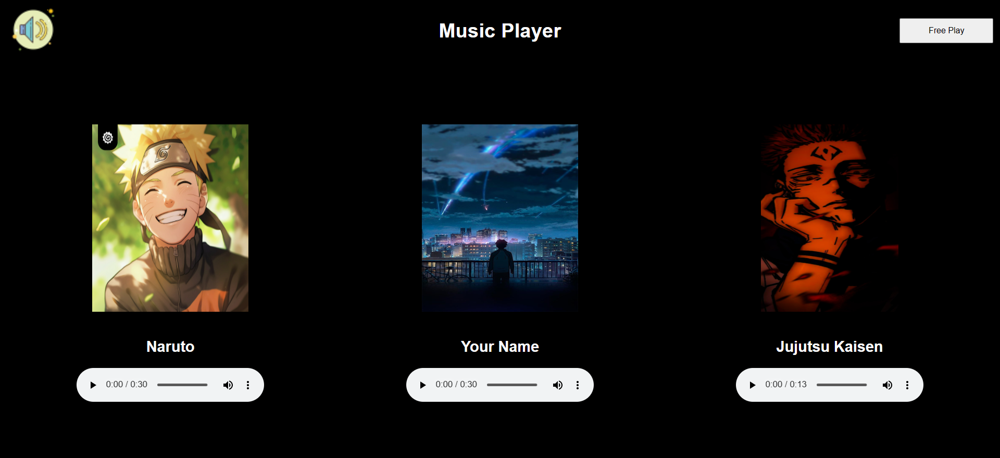

# My Resume
> _by Saloni_

This webpage titled Music Player is made using HTML. It's a part of HTML Assignment to create a simple music player using only HTML. This includes a bit of inline CSS as HTML5 does not support basic styling tags anymore. Three delightful anime music is provided on th screen and play/pause button is provided to do the same.

 * ## Tech Stack

    
    

 * ## Knowledge Gained

   1. Building html based project.

 * ## Output:

   